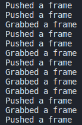

# Multithreading Example
Seth Lunders | ColdNTense
October 28, 2022 (mostly)

## Background
This was a small test project to accomplish the following things:
- Get some practice with DearPyGUI
- Read input data to queue on a **separate thread**
    - This method could be used for *any input*, here I used OpenCV to read from the webcam as a proof-of-concept.
- Processed data on the **main thread**
    - Read from the queue when there was something to read.
    - 'Processed' here meaning displayed to user.

## Steps
- (Requires webcam)
- Use pip or conda to create a virtual environment.
- Install the required packages from their respective requirements file.
- Run main.py in that environment

## Results
This was a success. It was fairly straightforward to create a new thread and share the data between the two threads as a queue.
```python
# In main.py
# Create thread, running the input function getFrameAsTexture
# (textureHandler is the other python file, I separated them to keep the code clean)
import textureHandler as th
t = Thread(target=th.getFrameAsTexture)
t.start()
```
```python
# In textureHandler.py
imgOut = Queue()
stopThread = False
# ...
def getFrameAsTexture():
    while not stopThread:
        ret, frame = webcam.read()
        data = np.flip(frame, 2) # BGR -> RGB
        data = data.ravel() # flatten
        data = np.asfarray(data, dtype='f') # change data to 32bit floats
        imgOut.put(np.true_divide(data, 255.0)) # normalize data
        # texture_data = imgOut.put(np.true_divide(data, 255.0)) # normalize data
        print("Pushed a frame")
    webcam.release()
```
```python
# Process the input data
while dpg.is_dearpygui_running():
    if not th.imgOut.empty():
        print("Grabbed a frame")
        dpg.set_value('texture_tag', th.imgOut.get())
```
In the output to the terminal—especially near the start of the program—we can see that it sometimes pushes image frames multiple times before they are processed, and vice-versa.  
  
This should be very useful in our project, as we need to be able read input data from multiple sensors **while** we process that data and display it to the user.
